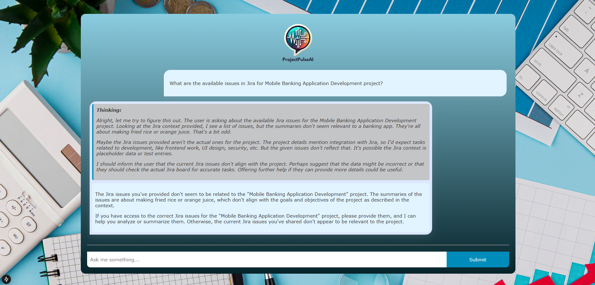

# ProjectPulseAI

ProjectPulseAI is a Next.js-based application designed for project managers. It leverages cutting-edge **Retrieval-Augmented Generation (RAG)** alongside a powerful Jira agent to integrate project documents, company resources, related web links, and Jira issues—all in one place.



## Features

- **Next.js Framework:**  
  Utilizes Next.js for a fast, scalable, and SEO-friendly web application.
- **Retrieval-Augmented Generation (RAG):**  
  Enhances LLM capabilities by dynamically integrating relevant documents and web resources for more insightful responses.
- **Jira Integration:**  
  Query and retrieve Jira issues directly from within the application, streamlining project management.
- **Document & Web Integration:**  
  Aggregates project and company documents and associated web links to provide comprehensive insights.

This is a [Next.js](https://nextjs.org) project bootstrapped with [`create-next-app`](https://nextjs.org/docs/pages/api-reference/create-next-app).

## Getting Started

### Prerequisites

- [Node.js](https://nodejs.org/) (version 20.14.0 recommended)

### Installation

1. **Clone the Repository**
   ```bash
   git clone https://github.com/SasiniWanigathunga/ProjectPulseAI.git
   cd ProjectPulseAI
   ```

2. **Install Dependencies**
   ```bash
   npm install
   # or
   yarn install
   # or
   pnpm install
   ```

### Configuration

Before running the application, ensure you configure the necessary environment variables:

Create a `.env` file and add the required keys:
```env
ASTRA_DB_NAMESPACE="your Astra DB namespace"
ASTRA_DB_COLLECTION="collection name of collection in your Astra DB database"
ASTRA_DB_API_ENDPOINT="API endpoint of your Astra DB database"
ASTRA_DB_APPLICATION_TOKEN="API endpoint of your Astra DB database"
GROQ_API_KEY="API key for groq.com"
HUGGINGFACE_API_KEY="Huggingface API key"
JIRA_API_TOKEN="API key of your Jira account"
JIRA_USERNAME="Jira account username"
JIRA_INSTANCE_URL="Jira instance url"
```

#### Adding Documents and Links
To enhance ProjectPulseAI’s capabilities, you can add documents and related links to be used in retrieval-augmented responses:

- **Adding Documents:**  
  Upload project-related documents (PDF or Word files) to the `app/data/` folder. These documents will be processed and used for querying relevant information.
- **Adding Web Links:**  
  Include relevant company and project-related web links in the `scripts/loaddb.ts` file. These links will be used to fetch contextual information during queries.

## Running the Text Embedding Generation API

To enable text embedding generation, you need to run the `main.py` file on a server with GPU access.

### Steps to Run the API:
1. Ensure you have Python installed with the necessary dependencies.
2. Install dependencies using:
   ```bash
   pip install fastapi transformers torch uvicorn
   ```
3. Run the API using Uvicorn on a GPU-enabled server:
   ```bash
   uvicorn main:app --host 0.0.0.0 --port 8000
   ```

### Running the Development Server

Start the development server with one of the following commands:
```bash
npm run dev
# or
yarn dev
# or
pnpm dev
# or
bun dev
```
Then open [http://localhost:3000](http://localhost:3000) in your browser to see the application in action.

## Application Overview

ProjectPulseAI is tailored for project management by providing:

- **Advanced Querying:**  
  Use RAG to extract insights from your project documents and related web content.
- **Jira Agent:**  
  Seamlessly retrieve and analyze Jira issues, enabling faster resolution of project queries.
- **Dynamic Content Integration:**  
  Easily incorporate and update various data sources including documents and web links to keep information relevant.

## Additional information from Next.js

You can start editing the page by modifying `pages/index.tsx`. The page auto-updates as you edit the file.

[API routes](https://nextjs.org/docs/pages/building-your-application/routing/api-routes) can be accessed on [http://localhost:3000/api/hello](http://localhost:3000/api/hello). This endpoint can be edited in `pages/api/hello.ts`.

The `pages/api` directory is mapped to `/api/*`. Files in this directory are treated as [API routes](https://nextjs.org/docs/pages/building-your-application/routing/api-routes) instead of React pages.

This project uses [`next/font`](https://nextjs.org/docs/pages/building-your-application/optimizing/fonts) to automatically optimize and load [Geist](https://vercel.com/font), a new font family for Vercel.

### Learn More

To learn more about Next.js, take a look at the following resources:

- [Next.js Documentation](https://nextjs.org/docs) - learn about Next.js features and API.
- [Learn Next.js](https://nextjs.org/learn-pages-router) - an interactive Next.js tutorial.

You can check out [the Next.js GitHub repository](https://github.com/vercel/next.js) - your feedback and contributions are welcome!

### Deploy on Vercel

The easiest way to deploy your Next.js app is to use the [Vercel Platform](https://vercel.com/new?utm_medium=default-template&filter=next.js&utm_source=create-next-app&utm_campaign=create-next-app-readme) from the creators of Next.js.

Check out our [Next.js deployment documentation](https://nextjs.org/docs/pages/building-your-application/deploying) for more details.

## Contact

For questions, feedback, or further information, please open an issue or contact at [wanigathungasasini@gmail.com](mailto:wanigathungasasini@gmail.com).

---

Happy managing with ProjectPulseAI!
